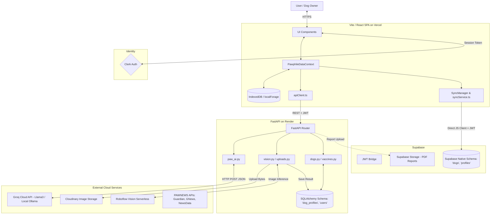

# PAWPHILE Architecture

This document maps the **ACTUAL** runtime system architecture for PAWPHILE based on the final repository audit.

> [!WARNING]
> This diagram reflects the "Split-Brain" database architecture discovered during the audit. The frontend pushes data to both the FastAPI backend and directly to Supabase Native tables.

## High-Level End-to-End Architecture

## Architecture Decisions

### 1. Database & Persistence (The Split-Brain Architecture)
- **DECISION**: Implement both FastAPI/SQLAlchemy (Backend) and Supabase Client (Frontend) simultaneously.
- **REASON**: The application was partially migrated. Original PWA/offline syncing logic (`SyncManager.tsx`) was built to sync directly with Supabase native tables (e.g., `preventive_care_records`). Later, a secure Python backend was introduced to handle AI/Vision logic, establishing its own SQLAlchemy ORM (`vaccine_records`, `dog_profiles`). 
- **CURRENT STATE**: **Partially Migrated / Split Brain**. The frontend sends data to BOTH the backend REST API and the Supabase direct tables.
- **TRADE-OFF**: This creates data duplication and maintenance overhead, but preserves the aggressive PWA offline-first capabilities that haven't been re-written for the REST API.
- **FUTURE CONSIDERATION**: Unified architecture. The frontend `SyncManager` should be refactored to queue REST API calls to FastAPI, removing the Supabase Javascript client from the frontend entirely, establishing FastAPI as the sole data gatekeeper.

### 2. Artificial Intelligence (PAW AI)
- **DECISION**: Use Ollama locally for development, with planned migration to Groq Cloud for production.
- **REASON**: Local execution (Ollama) protects data privacy during dev, but is too slow for production. Groq provides ultra-low latency inference which makes the chat interface feel real-time.
- **CURRENT STATE**: **Locally Working**. The backend connects to `http://localhost:11434`. Production deployment is blocked until a cloud provider is fully implemented.
- **TRADE-OFF**: Cannot run cloud AI right now.
- **FUTURE CONSIDERATION**: Implement the Groq integration before cloud release.

### 3. Computer Vision (Vision AI)
- **DECISION**: Use Roboflow Serverless Inference API via Python `inference_sdk`.
- **REASON**: Abstracting the vision model to a serverless workspace allows continuous model retraining on Roboflow without deploying heavy PyTorch/ONNX dependencies in the Render backend.
- **CURRENT STATE**: **Working (Production Ready)** for localization.

### 4. Safety Engine (Deterministic Guardrails)
- **DECISION**: Enforce hardcoded dictionaries (`TOXIC_FOODS`) and regex rules (`detect_emergency`) *before* the LLM.
- **REASON**: LLMs hallucinate. Deterministic rules override probabilistic generation.
- **CURRENT STATE**: **Working**.
