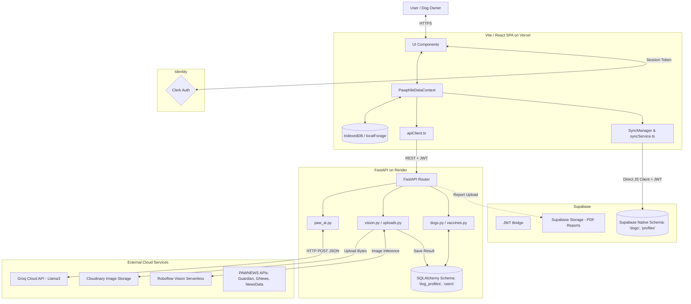

# PAWPHILE Architecture Diagram

This document maps the **ACTUAL** runtime system architecture for PAWPHILE based on the final repository audit.

> [!WARNING]
> This diagram reflects the "Split-Brain" database architecture discovered during the audit. The frontend pushes data to both the FastAPI backend and directly to Supabase Native tables.

## High-Level End-to-End Architecture

## Architecture Layers Detail

### 1. The Client Layer (Frontend)
- **Framework**: React 18 using Vite.
- **State Management**: `PawphileDataContext` holds all global state locally.
- **Offline / Sync**: `SyncManager.tsx` monitors `PawphileDataContext`. When data changes, it pushes the entire state directly to Supabase via `syncService.ts`.

### 2. The Identity Layer (Auth)
- **Provider**: **Clerk** handles user signup and issues JWTs.
- **Security**: The frontend sends the Clerk JWT as a Bearer token to FastAPI, and injects it into the Supabase Javascript Client headers.

### 3. The Backend Application Layer
- **Framework**: FastAPI (Python).
- **Core Role**: Processes AI and Vision requests, handles secure external API calls.

### 4. The Database Layer (SPLIT BRAIN)
- **Backend ORM**: The Python backend uses SQLAlchemy (`all_models.py`) to map objects to PostgreSQL tables (`users`, `dog_profiles`, `vaccine_records`).
- **Frontend Direct**: The Javascript frontend uses Supabase directly to push to tables (`profiles`, `dogs`, `preventive_care_records`).
- **Impact**: Data is currently duplicated and maintained in two distinct schemas.

### 5. The Storage Layer
- **Images**: Uploaded to **Cloudinary** by the backend `vision.py` before inference.
- **Reports**: Generated PDFs are uploaded to **Supabase Storage** by the backend `reports.py`.

### 6. The Intelligence Layer
- **Text**: Proxied through FastAPI to **Groq Cloud** running `llama3-70b-8192`.
- **Vision**: Proxied through FastAPI to **Roboflow's serverless inference API**.
