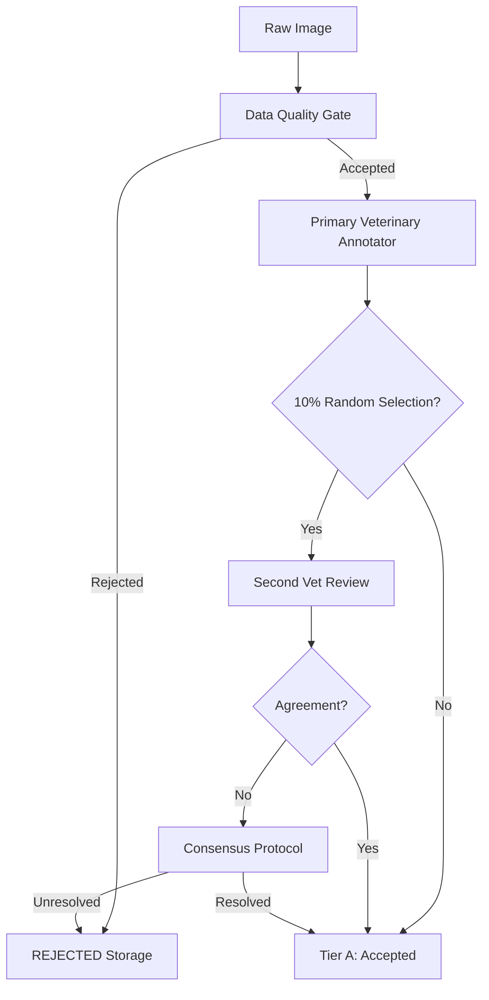

# PAWPHILE CV Clinical Annotation Protocol

This protocol dictates how raw images from veterinary partners are transformed into Tier A (Clinical Ground Truth) data for PAWPHILE Bin 2C model training.

> [!IMPORTANT]
> The overriding rule of PAWPHILE annotation is: **Do not guess**. If a lesion is unclear, obscured by fur, or ambiguous, do not annotate it. Mark the image as `REVIEW` or `REJECTED`.

## 1. Annotation Hierarchy
We support three annotation formats depending on the target lesion:
1. **IMAGE-LEVEL LABEL**: Used only for broad classifications (e.g., "Healthy").
2. **BOUNDING BOX (XYXY)**: Used for discrete, highly localized findings.
   - Pustule
   - Papule
   - Ulcer
   - Mass
3. **SEGMENTATION MASK (Polygons)**: Used for diffuse, irregularly shaped regions where pixel precision is required.
   - Erythema
   - Alopecia
   - Crust
   - Scaling
   - Lichenification

## 2. Veterinary Annotation Workflow

## 3. History and Traceability
Every annotation action must be logged in `review_history.json`.
We must NEVER silently overwrite an annotation. The history must show:
- Original annotator ID
- Original coordinates/labels
- Reviewer ID
- Correction applied
- Timestamp

If an annotator marks "Erythema" and the reviewer changes it to "Healthy", both records exist in the JSON to calculate Inter-Rater Reliability (IRR).

## 4. Disagreement Protocol
If two veterinarians disagree on a finding during the 10% double-blind review:
1. The image is flagged `clinical_validation_status = "conflict"`.
2. A third senior veterinarian reviews the image.
3. If consensus is reached, the status becomes `clinical_validation_status = "consensus"`.
4. If it remains ambiguous, the image is sent to the `REJECTED` pile. We do not train models on ambiguous data.
