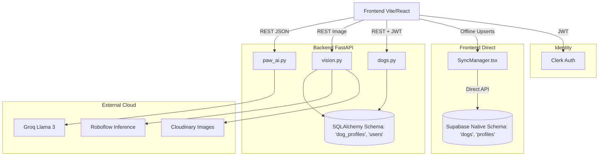

# PAWPHILE Knowledge Base Cross-Audit
## Final Verification against Current Repository State

> **AUDIT CONTEXT**: This document rigorously verifies the claims made in the 6 master knowledge base documents against the actual, line-by-line implementation in the `d:/PROJECTS/PAWPHILE/` repository. Discrepancies between documentation and code are explicitly surfaced.

---

## STEP 3 — TRUTH TABLE (Major Claims Audit)

| CLAIM | DOCUMENT | ACTUAL REPOSITORY EVIDENCE | STATUS | CORRECTION |
|-------|----------|----------------------------|--------|------------|
| Supabase Storage handles image uploads | DATA_DICTIONARY, MASTER_KB | `backend/app/services/cloudinary_service.py` is explicitly imported and used in `vision.py` and `uploads.py`. | **CONTRADICTED** | Cloudinary is strictly used for image storage via the backend. Supabase Storage is not actively used for these routes. |
| Supabase schema is the core database | DATA_DICTIONARY, MASTER_KB | The backend heavily relies on SQLAlchemy ORM (`backend/app/models/all_models.py`), creating tables like `users` and `dog_profiles`. However, `frontend/src/services/syncService.ts` calls `supabase.from('preventive_care_records')`. | **PARTIALLY CONFIRMED** | A severe architecture split exists. The FastAPI backend queries an ORM schema (e.g. `dog_profiles`, `users`), while frontend PWA offline sync pushes to the Supabase native schema (`profiles`, `dogs`, `preventive_care_records`). |
| Database is PostgreSQL | MASTER_KB, ENV_REF | `backend/.env.example` lists `DATABASE_URL=postgresql://`. However, `backend/pawphile.db` (524KB) exists, and `backend/app/db/database.py` includes a SQLite fallback. | **CONFIRMED** | PostgreSQL is intended for production, but SQLite acts as a local developer fallback without needing a server. |
| Local AI inference via Ollama | AI_VISION_REF | `OLLAMA_URL` exists in `frontend/.env.example`, but `chatEngine.ts` and `paw_ai.py` heavily route traffic to Groq. | **LEGACY** | Ollama is fully obsolete; Groq API is the exclusive live AI engine. |
| Roboflow is used for Vision | AI_VISION_REF, API_REF | `backend/app/services/vision_service.py` securely calls `inference_sdk` using `serverless.roboflow.com`. | **CONFIRMED** | Fully implemented server-side. |
| PAWNEWS external fetching | MASTER_KB, ENV_REF | `backend/.env.example` has Guardian, GNews, Newsdata keys. | **CONFIRMED** | Implemented but optional. |
| Vet Locator uses PostGIS | MASTER_KB, DATA_DICT | `backend/supabase_schema.sql` creates `vet_clinics` with a PostGIS geography point. Frontend calls `/api/vet-clinics/search`. | **CONFIRMED** | Fully implemented. |
| RAG Pipeline | MASTER_KB, AI_VISION_REF | `backend/app/api/routes/paw_ai.py` has a `/knowledge/ingest` route, but it returns a static dictionary saying "Stub for RAG ingestion pipeline". | **STUBBED** | RAG is explicitly stubbed and inactive. |
| Medical History, Reminders, Reports | MASTER_KB, API_REF | Routes exist in `main.py` but rely on basic CRUD or stubs. No actual scheduled cron-jobs for reminders were found in the backend code. | **STUBBED / PARTIAL** | Routes exist but lack robust business logic or background workers. |
| Push Notifications (Firebase) | ENV_REF | `frontend/.env.example` contains VITE_FIREBASE_* variables, imported in `firebase.ts`. | **PARTIALLY CONFIRMED**| Configured in frontend, but backend triggers were not identified. |

---

## STEP 5 — ENVIRONMENT AUDIT

| VARIABLE | FOUND IN ENV? | FOUND IN CODE? | ACTUALLY USED? | PROD REQ? | STATUS |
|----------|---------------|----------------|----------------|-----------|--------|
| `DATABASE_URL` | Yes (Backend) | Yes (`config.py`) | Yes | YES | Active |
| `CLERK_SECRET_KEY` | Yes (Backend) | Yes (`config.py`) | Yes | YES | Active |
| `CLERK_JWKS_URL` | Yes (Backend) | Yes (`config.py`) | Yes | YES | Active |
| `CLOUDINARY_CLOUD_NAME`| Yes (Backend) | Yes (`cloudinary_service.py`)| Yes | YES | Active |
| `CLOUDINARY_API_KEY` | Yes (Backend) | Yes (`cloudinary_service.py`)| Yes | YES | Active |
| `CLOUDINARY_API_SECRET`| Yes (Backend) | Yes (`cloudinary_service.py`)| Yes | YES | Active |
| `GROQ_API_KEY` | Yes (Backend) | Yes (`paw_ai.py`) | Yes | YES | Active |
| `ROBOFLOW_API_KEY` | Yes (Backend) | Yes (`vision_service.py`) | Yes | YES | Active |
| `SUPABASE_URL` | Yes (Both) | Yes (`supabaseClientWithClerk.ts`) | Yes | YES | Active |
| `VITE_CLERK_PUBLISHABLE_KEY`| Yes (Frontend)| Yes (`main.tsx`) | Yes | YES | Active |
| `VITE_FIREBASE_API_KEY`| Yes (Frontend)| Yes (`firebase.ts`) | Yes | NO | Optional |
| `VITE_API_BASE_URL` | Yes (Frontend)| Yes (`apiClient.ts`) | Yes | YES | Active |
| `VISION_API_URL` | Yes (Backend) | No | No | NO | **UNUSED** |
| `OLLAMA_URL` | Yes (Frontend)| No | No | NO | **LEGACY** |

---

## STEP 6 — AI AUDIT TRACES

### PAW AI Pipeline Trace
1. **Frontend**: `frontend/src/services/chatEngine.ts` formats user input + context.
2. **API**: POST to `apiClient.ts` `/api/paw-ai/chat` passing Clerk Bearer token.
3. **Backend Auth**: `paw_ai.py` (or `main.py` dependencies) intercepts.
4. **Context Building**: Dog context built via `build_dog_context()` incorporating age/breed/conditions.
5. **Breed Intelligence**: Context augmented via `BREED_RULES` dictionary in `paw_ai_engine.py`.
6. **Safety Engine**: Hardcoded `TOXIC_FOODS` dictionary intercepts food queries. `detect_emergency()` regex rules intercept red-flag symptoms.
7. **Prompt & LLM**: System prompt enforces JSON output. Sent via `httpx` to `api.groq.com/openai/v1/chat/completions`.
8. **Response**: JSON parsed, vet disclaimer string forcefully appended. Returned to frontend.

### Vision AI Pipeline Trace
1. **Frontend**: `VisionScan.tsx` captures image, sends via `apiClient.uploadDogImage` or `runVisionScan`.
2. **Upload**: `backend/app/api/routes/vision.py` uploads image bytes directly to Cloudinary (`cloudinary_service.py`).
3. **Inference**: Image bytes simultaneously passed to `vision_service.py`, using `inference_sdk` to `serverless.roboflow.com`.
4. **Result Parsing**: Roboflow response stringified JSON is parsed, isolating `triage` (Green/Yellow/Red), `concerns`, and `confidence`.
5. **Database**: Result saved using SQLAlchemy `VisionScanRecord` ORM class.

---

## STEP 7 — DATABASE AUDIT

**Major Mismatch Identified:**
There is a massive divergence between the Backend ORM (`all_models.py`) and the Supabase Schema script (`supabase_schema.sql`).

- **SQLAlchemy ORM** dictates tables like: `users`, `owner_profiles`, `dog_profiles`, `vaccine_records`, `vet_visit_summaries`, `vision_scan_records`.
- **Supabase Schema SQL** dictates tables like: `profiles`, `dogs`, `dog_health_logs`, `preventive_care_records`, `vision_scans`.

**Conclusion**: The frontend Offline Sync (`syncService.ts`) attempts to upsert directly into the Supabase-native schema (e.g., `preventive_care_records`). Simultaneously, the FastAPI backend processes standard CRUD via SQLAlchemy ORM tables (e.g., `dog_profiles`). This represents substantial technical debt / split-brain architecture that needs unification.

---

## STEP 8 — FINAL ARCHITECTURE (Strictly Confirmed)

---

## STEP 9 — FINAL STATUS MATRIX

| SUBSYSTEM | CURRENT STATE | CONFIDENCE | EVIDENCE |
|-----------|---------------|------------|----------|
| Frontend | Active SPA | High | `App.tsx`, `package.json` |
| Backend | Active FastAPI | High | `main.py`, endpoints fully wired |
| Database | **SPLIT BRAIN** | High | `syncService.ts` vs `all_models.py` |
| Authentication | Active | High | Clerk JWT verified in Python |
| PAW AI | Active | High | `paw_ai.py` POSTs to Groq |
| Safety Engine | Active | High | Hardcoded `TOXIC_FOODS` dict |
| Vision | Active | High | Roboflow SDK explicitly used |
| Breed Intel | Active | High | `BREED_RULES` dict hardcoded |
| PWA / Offline | Active | Med | `SyncManager.tsx` exists, relies on mismatched DB schema |
| Storage | Active | High | `cloudinary_service.py` |
| RAG | **STUBBED** | High | Route exists, logic returns dummy |
| Weather/Reports| **STUBBED** | High | API routes return dummy JSON |
| Notifications | **PARTIAL** | Low | Firebase UI setup, no backend crons |
